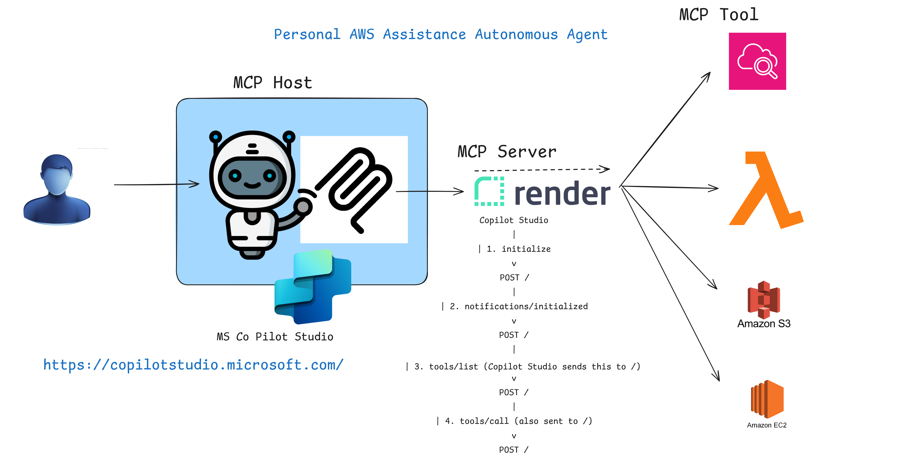

[](https://www.python.org/) [](https://fastapi.tiangolo.com/) [](https://aws.amazon.com/) [](https://boto3.amazonaws.com/) [](https://www.jsonrpc.org/) [](https://modelcontextprotocol.io/) [](https://render.com/) [](https://github.com/)

# AWS MCP Server: Enterprise-Grade Autonomous AI Agent

> **Building Intelligent AWS Automation with Model Context Protocol (MCP), Git, and Microsoft Copilot Studio**

---

##  Architecture Diagram



---

## 📋 Table of Contents

- [Executive Overview](#executive-overview)
- [Technology Stack](#technology-stack)
- [System Architecture](#system-architecture)
- [Core Features](#core-features)
- [MCP Protocol Implementation](#mcp-protocol-implementation)
- [Available Tools](#available-tools)
- [Installation & Deployment](#installation--deployment)
- [API Endpoints](#api-endpoints)
- [Configuration](#configuration)
- [Deployment on Render](#deployment-on-render)
- [Usage Examples](#usage-examples)
- [Architecture Deep Dive](#architecture-deep-dive)
- [References & Resources](#references--resources)
- [Contact & Support](#contact--support)

---

## 🎯 Executive Overview

**AWS MCP Server** is an enterprise-grade Model Context Protocol (MCP) implementation that bridges the gap between autonomous AI agents and AWS cloud resources. This solution enables Microsoft Copilot Studio, Claude, and other MCP-compatible clients to seamlessly interact with AWS services through a structured, secure protocol.

### Key Capabilities

- **Real-Time AWS Integration**: Direct access to EC2, S3, Lambda, CloudWatch, Cost Explorer, and IAM
- **MCP Protocol Compliance**: Full JSON-RPC 2.0 implementation with handshake negotiation
- **Production-Ready**: Deployed on Render with continuous Git-based deployment
- **Audit & Logging**: Comprehensive action logging to S3 for compliance and debugging
- **Extensible Architecture**: Easy addition of new AWS tools and capabilities

---

## 🛠️ Technology Stack

| Component | Technology | Purpose |
|-----------|-----------|---------|
| **Runtime** | Python 3.9+ | Core application language |
| **Web Framework** | FastAPI | High-performance async HTTP server |
| **ASGI Server** | Uvicorn | Production-grade ASGI application server |
| **Protocol** | JSON-RPC 2.0 + MCP | Structured AI-to-tool communication |
| **AWS SDK** | Boto3 | AWS service interaction |
| **Cloud Storage** | AWS S3 | Audit log persistence |
| **Deployment** | Render | Continuous deployment platform |
| **Version Control** | Git + GitHub | Source code management |
| **Client Integration** | Microsoft Copilot Studio | Autonomous AI agent orchestration |

---

## 📐 System Architecture

The AWS MCP Server operates as a middleware layer between AI clients and AWS infrastructure:

```
┌─────────────────────────────────────────────────────────────────┐
│                     Microsoft Copilot Studio                     │
│                   (Autonomous AI Agent Client)                   │
└────────────────────────────┬────────────────────────────────────┘
                             │
                      JSON-RPC Requests
                             │
┌────────────────────────────▼────────────────────────────────────┐
│                      AWS MCP Server                              │
│  ┌──────────────┐  ┌──────────────┐  ┌──────────────┐           │
│  │   FastAPI    │  │ MCP Protocol │  │ Tool Router  │           │
│  │  (Uvicorn)   │  │ Handshake    │  │  Dispatcher  │           │
│  └──────────────┘  └──────────────┘  └──────────────┘           │
└────────────────────────────┬────────────────────────────────────┘
                             │
        ┌────────┬─────────┬─┴──┬────────┬──────────┐
        │        │         │    │        │          │
   ┌────▼─┐ ┌───▼──┐ ┌────▼┐ ┌─▼────┐ ┌▼────┐ ┌───▼───┐
   │ EC2  │ │  S3  │ │ IAM │ │Lambda│ │Logs │ │Budgets│
   └──────┘ └──────┘ └─────┘ └──────┘ └─────┘ └───────┘
   
                  AWS Cloud Services
```

---

## ✨ Core Features

### 1. **MCP Handshake Protocol**
- Full JSON-RPC 2.0 compliance
- Automatic capability negotiation
- Support for `initialize`, `ping`, and notification handling
- Error handling with standardized error codes

### 2. **Tool Discovery & Execution**
- Dynamic tool listing via `/mcp/tools/list`
- Safe tool invocation via `/mcp/tools/call`
- Argument validation and type checking
- Comprehensive error responses

### 3. **AWS Service Integration**
- EC2 instance management (list, create, terminate)
- S3 bucket operations (list, create)
- Lambda function discovery
- CloudWatch log group inspection
- Cost analysis via Cost Explorer
- Budget tracking and monitoring
- IAM role and policy management

### 4. **Production-Grade Features**
- CORS support for Copilot Studio integration
- Audit logging to S3 with timestamps
- Request/response logging for debugging
- Automatic error handling and recovery
- Thread-safe async operations

---

## 🔄 MCP Protocol Implementation

### Handshake Flow

```python
# 1. Client sends initialize request
POST / HTTP/1.1
{
  "jsonrpc": "2.0",
  "id": 1,
  "method": "initialize",
  "params": {}
}

# 2. Server responds with capabilities
{
  "jsonrpc": "2.0",
  "id": 1,
  "result": {
    "protocolVersion": "2024-01-01",
    "serverInfo": {
      "name": "aws-mcp-server",
      "version": "1.0.0"
    },
    "capabilities": {
      "tools": {
        "list": True,
        "call": True
      }
    }
  }
}

# 3. Client acknowledges initialization
{
  "jsonrpc": "2.0",
  "id": 2,
  "method": "notifications/initialized",
  "params": {}
}
```

### Tool Invocation Pattern

```python
# Request tool listing
{
  "jsonrpc": "2.0",
  "id": 3,
  "method": "tools/list",
  "params": {}
}

# Call a tool
{
  "jsonrpc": "2.0",
  "id": 4,
  "method": "tools/call",
  "params": {
    "name": "list_ec2_instances",
    "arguments": {}
  }
}
```

---

## 🛠️ Available Tools

### EC2 Management
- `list_ec2_instances`: List all EC2 instances with state and type
- `create_ec2_instance`: Launch t2.micro instances
- `terminate_ec2_instance`: Terminate instances by ID

### S3 Operations
- `list_s3_buckets`: Enumerate all S3 buckets
- `create_s3_bucket`: Create new S3 buckets

### Lambda Functions
- `list_lambda_functions`: Discover Lambda functions in region

### Monitoring & Logging
- `list_log_groups`: List CloudWatch log groups
- `get_estimated_cost`: Retrieve 6-month cost analysis
- `list_budgets`: Display AWS budgets and utilization

---

## 🚀 Installation & Deployment

### Local Development

#### Prerequisites
```bash
Python 3.9+
pip (Python package manager)
AWS credentials configured locally
```

#### Setup Steps

1. **Clone the repository**
```bash
git clone https://github.com/roy777rajat/AWS-MCP-SERVER.git
cd aws-mcp-server
```

2. **Create Python virtual environment**
```bash
python -m venv venv
source venv/bin/activate  # On Windows: venv\Scripts\activate
```

3. **Install dependencies**
```bash
pip install -r requirements.txt
```

4. **Configure AWS credentials**
```bash
# Option 1: Using AWS CLI
aws configure

# Option 2: Environment variables
export AWS_ACCESS_KEY_ID=<your-key>
export AWS_SECRET_ACCESS_KEY=<your-secret>
export AWS_REGION=eu-west-1
```

5. **Set environment variables**
```bash
export AUDIT_BUCKET=aws-mcp-audit-logs-<your-username>
export AWS_REGION=eu-west-1
```

6. **Run locally**
```bash
python -m uvicorn server:app --reload --port 8000
```

The server will be available at `http://localhost:8000`

---

## 🔌 API Endpoints

### Health Check
```http
GET /
Response: {"status": "ok", "mcp": "server running"}
```

### Manifest
```http
GET /mcp/manifest.json
Response: Server capabilities and tool endpoints
```

### MCP Handshake
```http
POST /
Request: JSON-RPC initialize/ping/notifications
Response: Protocol negotiation and capabilities
```

### Tool Operations
```http
POST /mcp/tools/list
Response: List of available tools

POST /mcp/tools/call
Request: Tool name and arguments
Response: Tool execution result
```

---

## ⚙️ Configuration

### Environment Variables

| Variable | Default | Description |
|----------|---------|-------------|
| `AWS_REGION` | eu-west-1 | AWS region for resource operations |
| `AUDIT_BUCKET` | aws-mcp-audit-logs-rajat | S3 bucket for audit logs |
| `AWS_ACCESS_KEY_ID` | - | AWS access key (from ~/.aws/credentials) |
| `AWS_SECRET_ACCESS_KEY` | - | AWS secret key (from ~/.aws/credentials) |

### AWS Permissions Required

```json
{
  "Version": "2012-10-17",
  "Statement": [
    {
      "Effect": "Allow",
      "Action": [
        "ec2:DescribeInstances",
        "ec2:RunInstances",
        "ec2:TerminateInstances",
        "s3:ListAllMyBuckets",
        "s3:CreateBucket",
        "lambda:ListFunctions",
        "logs:DescribeLogGroups",
        "ce:GetCostAndUsage",
        "budgets:DescribeBudgets",
        "s3:PutObject"
      ],
      "Resource": "*"
    }
  ]
}
```

---

## 🌐 Deployment on Render

### One-Click Deployment

1. **Push code to GitHub**
```bash
git add .
git commit -m "AWS MCP Server ready for production"
git push origin main
```

2. **Connect to Render**
   - Go to [Render Dashboard](https://dashboard.render.com)
   - Create New → Web Service
   - Connect GitHub repository
   - Configure environment variables

3. **Deployment Configuration**
   - **Build Command**: `pip install -r requirements.txt`
   - **Start Command**: `uvicorn server:app --host 0.0.0.0 --port $PORT`
   - **Environment**: Python 3.9

4. **Set Environment Variables in Render**
```
AWS_REGION=eu-west-1
AUDIT_BUCKET=aws-mcp-audit-logs-rajat
AWS_ACCESS_KEY_ID=<your-key>
AWS_SECRET_ACCESS_KEY=<your-secret>
```

### Continuous Deployment
- Every push to `main` branch triggers automatic rebuild
- Service goes live in ~2-3 minutes
- Zero downtime deployments

---

## 📚 Usage Examples

### Example 1: List EC2 Instances

**Request**
```json
{
  "jsonrpc": "2.0",
  "id": 1,
  "method": "tools/call",
  "params": {
    "name": "list_ec2_instances",
    "arguments": {}
  }
}
```

**Response**
```json
{
  "jsonrpc": "2.0",
  "id": 1,
  "result": {
    "content": {
      "instances": [
        {
          "instance_id": "i-0123456789abcdef0",
          "state": "running",
          "type": "t2.micro"
        }
      ]
    }
  }
}
```

### Example 2: Get Estimated Costs

**Request**
```json
{
  "jsonrpc": "2.0",
  "id": 2,
  "method": "tools/call",
  "params": {
    "name": "get_estimated_cost",
    "arguments": {}
  }
}
```

**Response**
```json
{
  "jsonrpc": "2.0",
  "id": 2,
  "result": {
    "content": {
      "cost": {
        "ResultsByTime": [
          {
            "TimePeriod": {"Start": "2024-01-01", "End": "2024-01-31"},
            "Total": {"UnblendedCost": {"Amount": "1234.56", "Unit": "USD"}}
          }
        ]
      }
    }
  }
}
```

---

## 🏗️ Architecture Deep Dive

### Request Processing Pipeline

```
1. CORS Middleware
   ↓
2. JSON-RPC Parser
   ↓
3. Method Router
   ├─ initialize → Handshake Handler
   ├─ tools/list → Tool Discovery
   ├─ tools/call → Tool Router
   └─ ping → Echo
   ↓
4. AWS Service Call
   ↓
5. Response Formatter
   ↓
6. Audit Logger
   ↓
7. JSON Response
```

### Fault Tolerance & Error Handling

- **JSON Parse Errors**: Graceful fallback with error response
- **Missing Tool Names**: -32602 Invalid Parameter error
- **Unknown Tools**: -32601 Method Not Found error
- **AWS API Failures**: -32000 Server Error with exception message
- **Logging Failures**: Silent fallback, doesn't interrupt tool execution

### Security Considerations

- ✅ CORS enabled for Copilot Studio compatibility
- ✅ AWS credentials in environment variables (not hardcoded)
- ✅ All actions logged to S3 for audit trails
- ✅ Input validation on tool parameters
- ✅ Error messages without sensitive data exposure

---

## 📖 References & Resources

### Original Medium Article
- **Title**: Building an MCP-Powered Autonomous AI Agent with Git, Render, and Microsoft Copilot Studio
- **Author**: Rajat Roy
- **Link**: [Read on Medium](https://medium.com/@uk.rajatroy/building-an-mcp-powered-autonomous-ai-agent-with-git-render-and-microsoft-copilot-studio-1b9c74d5cfb8)

### Official Documentation
- [Model Context Protocol Specification](https://modelcontextprotocol.io/)
- [FastAPI Documentation](https://fastapi.tiangolo.com/)
- [Boto3 AWS SDK Documentation](https://boto3.amazonaws.com/v1/documentation/api/latest/index.html)
- [Microsoft Copilot Studio](https://copilot.microsoft.com/)
- [Render Deployment Guide](https://render.com/docs)

### Related Technologies
- **MCP**: Standardized protocol for AI model integration
- **JSON-RPC 2.0**: Stateless, lightweight RPC protocol
- **FastAPI**: Modern, fast Python web framework
- **AWS Services**: Comprehensive cloud platform

---

## 👨‍💼 Contact & Support

### Author

**Rajat Roy**
- Full-Stack Developer & Cloud Solutions Architect
- Expertise in AI-driven business transformation
- Specialization: AWS, Data Engineering, Workflow Automation

### Social & Professional Links

- **Medium**: [@uk.rajatroy](https://medium.com/@uk.rajatroy)
- **GitHub**: [roy777rajat](https://github.com/roy777rajat)
- **LinkedIn**: [Connect on LinkedIn](https://linkedin.com/in/uk-rajat-roy)
- **Email**: Contact through GitHub profile

### Project Links

- **GitHub Repository**: [AWS-MCP-SERVER](https://github.com/roy777rajat/AWS-MCP-SERVER.git)
- **Deployed Service**: Available on Render (auto-deployed on push)
- **Documentation**: This README + Medium article

### Support & Contributions

- 🐛 **Bug Reports**: Create GitHub issues
- 💡 **Feature Requests**: Submit pull requests or issues
- 📧 **Questions**: Reach out via GitHub discussions
- 🤝 **Contributions**: Welcome! Follow standard Git workflow

---

## 📝 License

This project is provided as-is for educational and commercial use. See GitHub repository for license details.

---

## 🎓 Learning Path

For engineers looking to understand this architecture:

1. **Phase 1**: Read the Medium article for business context
2. **Phase 2**: Review this README for technical overview
3. **Phase 3**: Examine `server.py` for implementation details
4. **Phase 4**: Deploy locally and test with curl/Postman
5. **Phase 5**: Deploy to Render and integrate with Copilot Studio
6. **Phase 6**: Extend with custom AWS tools

---

## ✅ Checklist for Production Deployment

- [ ] AWS credentials configured securely
- [ ] Audit S3 bucket created and accessible
- [ ] All environment variables set in Render
- [ ] GitHub repository connected to Render
- [ ] Copilot Studio integration tested
- [ ] Error logs monitored
- [ ] Audit logs reviewed regularly
- [ ] Scaling configured as needed

---

**Built with ❤️ using FastAPI, MCP, and AWS**

*Last Updated: January 2026*
